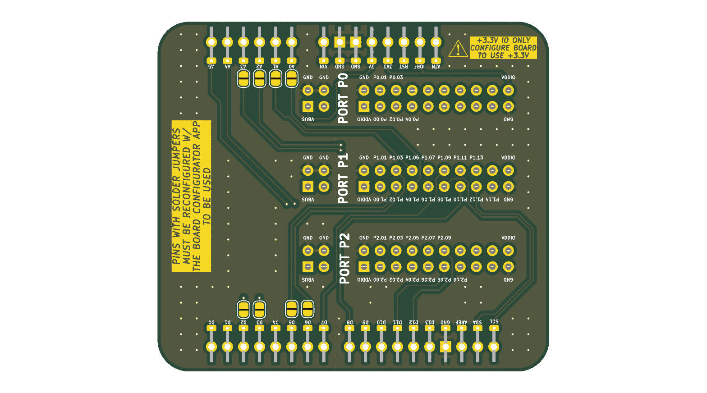
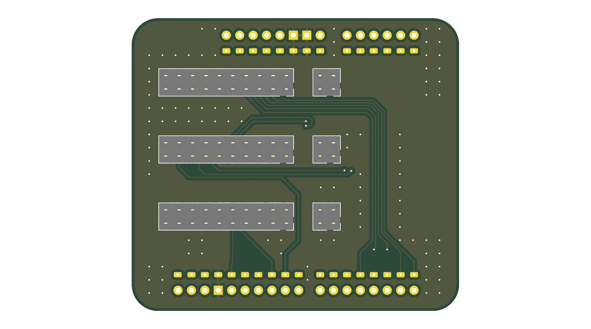

# nRF54L15-DK to Arduino Shield Adapter

This adapter board allows you to connect Arduino shields to your nRF54L15-DK development kit for basic prototyping needs.

  

## Features

- Compatible with nRF54L15-DK development kit
- Standard Arduino shield form factor
- Solder jumpers for pin configuration flexibility

## ⚠️ Important Usage Notes

- **3.3V OPERATION ONLY** - Configure your nRF54L15-DK to use +3.3V logic
- Pins with solder jumpers are **NOT CONNECTED BY DEFAULT**
- **PINS WITH SOLDER JUMPERS MUST BE RECONFIGURED WITH THE BOARD CONFIGURATOR APP TO BE USED**

  

## Getting Started

1. Ensure your nRF54L15-DK is configured for 3.3V operation
2. Attach this adapter board to your nRF54L15-DK
3. For pins with solder jumpers:
   - Keep jumpers open for default configuration
   - If needed, close jumpers and reconfigure pins using the Board Configurator App

## Compatibility

This adapter is designed for basic Arduino shields that operate at 3.3V logic levels. Shields requiring 5V logic are not supported without additional level shifting.
